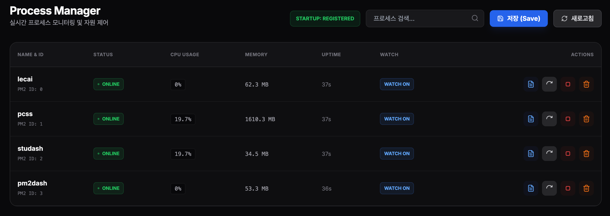

# PM2Dash

FastAPI 기반의 실시간 PM2 프로세스 모니터링 및 관리 대시보드입니다. 웹 브라우저에서 서버의 프로세스 상태를 한눈에 파악하고 제어할 수 있습니다.

<p align="center">
  
</p>

## 주요 기능
* 실시간 모니터링: CPU 사용량, 메모리 점유율, 업타임 실시간 업데이트
* 프로세스 제어: 웹 UI에서 즉시 Restart, Stop, Delete, Watch 모드 전환 가능
* 실시간 로그 스트리밍: WebSocket을 통한 실시간 프로세스 로그 확인
* 보안 접속: 환경 변수 기반의 관리자 로그인 기능 (ID/PW 세션 인증)

## 시작하기

### 1. 가상환경 구축 및 활성화
```bash
uv sync
```

### 2. 환경 변수 설정 (.env)
프로젝트 루트 디렉토리에 .env 파일을 생성하고 로그인 정보를 설정합니다.
```bash
cp .env.example .env
```
**.env 설정 예시:**
```env
ADMIN_USER=admin
ADMIN_PASS=admin1234
SECRET_KEY=your_random_secret_key_here
PORT=8000
```

### 3. 대시보드 실행
```bash
python3 run.py
```
실행 후 브라우저에서 http://localhost:8000 접속하여 설정한 계정으로 로그인합니다.

## 프로젝트 구조
```text
PM2Dash/
├── app/
│   ├── routes/          # 페이지 라우팅 (pm2_routes.py, auth_routes.py)
│   ├── services/        # 비즈니스 로직 (pm2_service.py, auth_service.py)
│   ├── templates/       # HTML 템플릿 (process.html, login.html)
│   └── main.py          # FastAPI 앱 및 세션 미들웨어 설정
├── venv/                # 파이썬 가상환경
├── .env                 # 환경 변수 (인증 및 보안 설정)
├── README.md            # 프로젝트 문서
├── requirements.txt     # 설치 필요 패키지 목록
└── run.py               # 서버 실행 엔트리포인트
```

---
